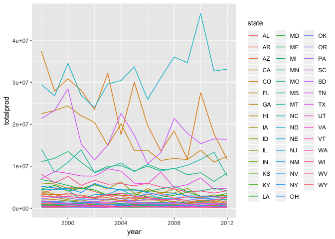

Playing with honey data
================
Kaitlin Maciejewski

##### This data set is from kaggle: <https://www.kaggle.com/jessicali9530/honey-production/data>

##### It shows honey production numbers and prices by state from 1998-2012

Summary plots
=============

Below are spaghetti plots for each state over time. Number of colonies, total production, and product value over time are examined.

``` r
library(readr)
honeyproduction <- read_csv("honey-production/honeyproduction.csv")
```

``` r
library(ggplot2)

p1 = ggplot(honeyproduction, aes(year, numcol, color = state)) + 
  geom_path()
print(p1)
```


``` r
p2 = ggplot(honeyproduction, aes(year, totalprod, color = state)) + 
  geom_path()
print(p2)
```



``` r
p3 = ggplot(honeyproduction, aes(year, prodvalue, color = state)) + 
  geom_path()
print(p3)
```


Heat maps
=========

``` r
library(usmap)

honeyproduction_1998 <- (subset(honeyproduction,year = 1998))

plot_usmap(data = honeyproduction_1998, values = "prodvalue")
```


Regression
==========
